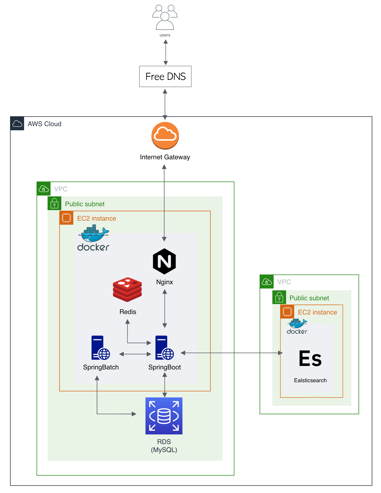

# 오늘의 퀘스트

### 프로젝트 소개

---
매일 해야될 일을 더 재밌게 계획하고 할 수 없을까 해서 만들게 된 서비스입니다.   
게임 시스템을 접목해 할일을 퀘스트로 등록하고 완료해 경험치와 골드 보상을 획득하고 업적을 달성할 수 있습니다.   

### 기술 스택

---
- Kotlin, Java17
- Spring Framework (Spring Boot 3, Spring MVC, Spring Batch, Spring Security, Spring Data)
- MySQL, JPA, QueryDSL, Redis, Elasticsearch
- Junit5, Spring Test, Mockito, Mockk, Testcontainers
- Gradle
- Docker
- AWS S3, RDS, SNS, SQS
- Git, GitHub Actions(CI/CD), CodeDeploy
- Vue3.js

### 아키텍처

---

